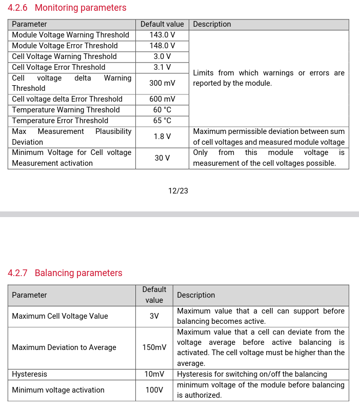
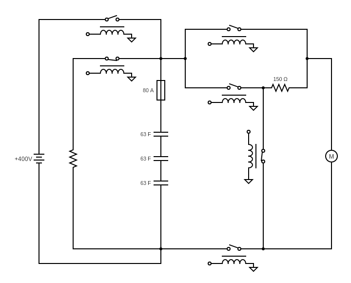

# HVSCU Cabinet H10

The High Voltage Safety Control Unit (HVSCU) monitors the high voltage Energy Storage System (ESS) and controls the contactors that change the electrical circuit configuration.

The system uses two such boards, one onboard the vehicle and the other on the electrical cabinet used for the booster inverter and power supply. This code repository focuses on the HVSCU inside the electrical cabinet.

## Responsibilities

* Controling the six contactors inside the electrical cabinet to control the high voltage circuit
* Monitoring the inverter DC-link voltage and all the ESS cells

## Comercial Components

### ESS

Three ESS Modules from SECH are used to obtain the desired voltage (400V) and capacitance (21F).

Module Name: M35W-144-0063

* [User Manual](./Documentation/ESS/20231012_M35W-144-0063_ESS_User_Manual.pdf)
* [Data Sheet](./Documentation/ESS/220506-Sech-datasheet-ESS-module.pdf)

Default Parameters:

### Contactors

Six contactors are used to control the circuit: two are normally closed (NC) and four are normally open (NO).

The circuit is configured as follows:

